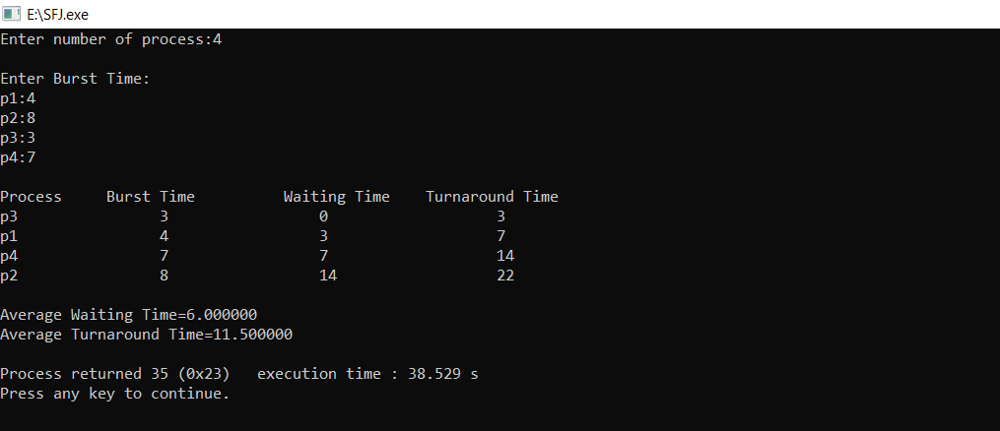

# SJF
<h1>Shortest Job First (SJF) Scheduling Algorithm</h1>
<h2>Burst Time Calculation for Processes</h2>
<h4>Shortest Job First (SJF) is a scheduling algorithm that selects the waiting process with the smallest execution time to execute next. It minimizes the average waiting time for a given set of processes.</h4>
<h3>Description</h3>
<h4>This program calculates the waiting time and turnaround time for processes based on their burst time using the selection sort algorithm to sort burst times in ascending order.</h4>
<h2>Input Details</h2>
<h3>The program takes the following inputs:</h3>
<ul>
<li><strong>Number of processes (n):</strong> User input.</li>
<li><strong>Burst Time for each process:</strong> User input for each process.</li>
</ul>
<h2>Output below is an example image illustrating the burst time calculation process:</h2>

   

